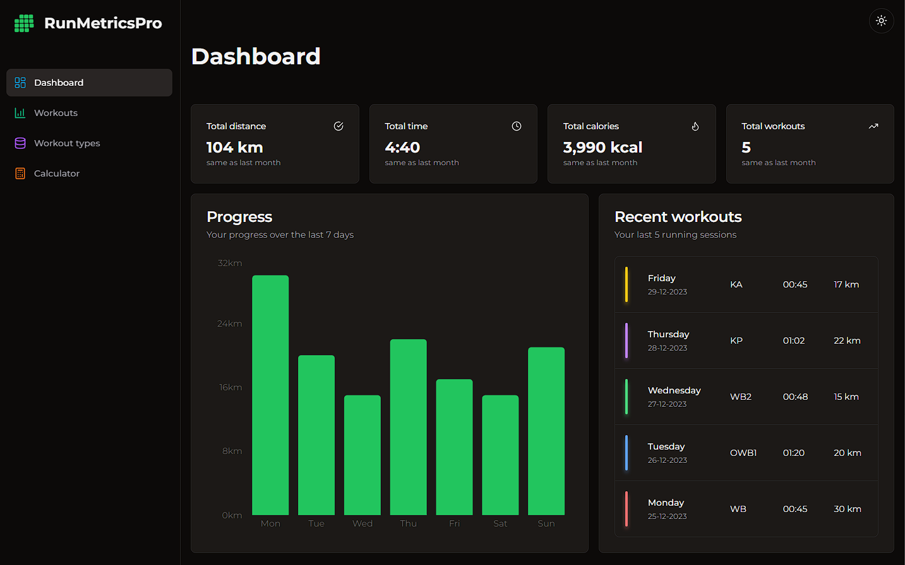
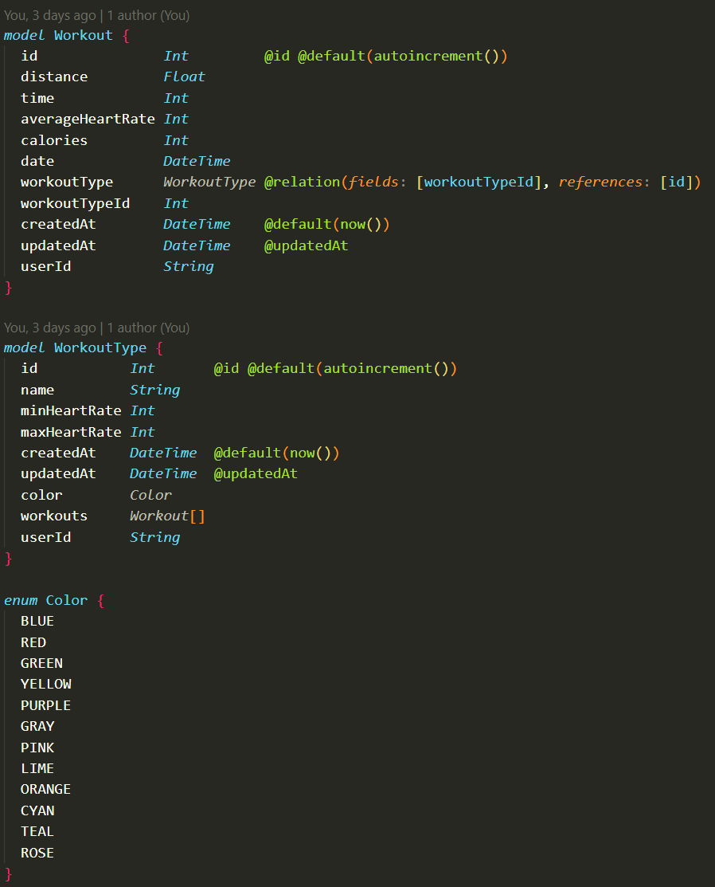

# RunMetricsPro

RunMetricsPro is a web application for runners to track their progress and show different metrics to improve performance. The app also contains some utility calculators such as the average pace per km for a marathon target time, daily calorie intake or 1RM, which can benefit all kinds of athletes and people trying to improve their fitness and health. 

## Tech stack

Next.js 14, React, Prisma, PostgreSQL, Tailwind, Shadcn/UI, Framer Motion

## Screenshots



## Database schema



## Run Locally

1. Clone the project

```bash
  git clone https://github.com/piotrv1001/run-metrics-pro.git
```

2. Install dependencies

```bash
  npm install
```

3. Create a <b>.env</b> file variable to connect to a local PostgreSQL database

```bash
  DATABASE_URL="postgresql://postgres:<password>@localhost:5432/<db>"
```

<i>Note: This requires to have a local PostgreSQL database running on port 5432.</i>

4. Update your db with the prisma schema

```bash
  npx prisma db push
```

5. Run the dev server

```bash
  npm run dev
```

## Features

- React Server Components
- App Router
- Server Actions
- Framer Motion animations
- Clerk auth
- Vercel hosting